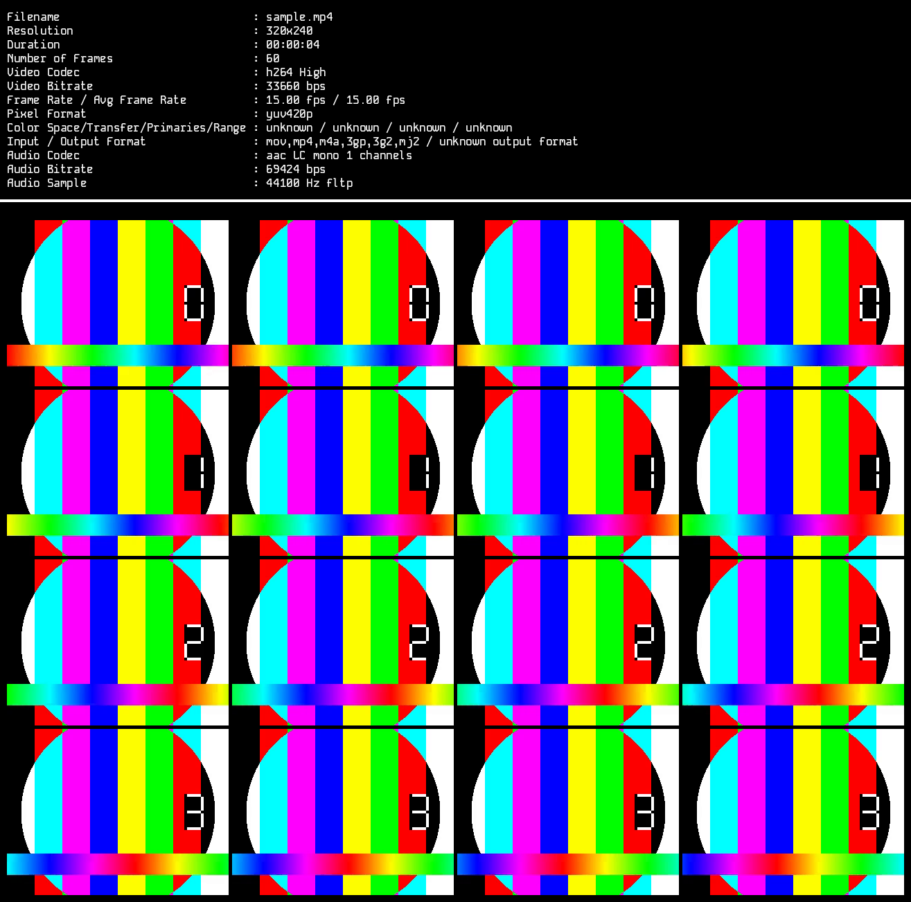

# osheet_cpp

C++23 project that using FFMPEG + Skia libraries to create video contact sheet.

## Features

- Single executable. FFMPEG and Skia is linked to the executable so does not rely on external FFMPEG executable.
- Using Google's [Skia](https://github.com/google/skia) for creating video contact sheet output.
- Using Skia's and FFMPEG's best qualities as default.
- Configurable arguments as [CLI arguments](#cli-arguments).

## CLI Arguments

```bash
❯ ./build/osheet_cpp --help               
Usage: osheet_cpp [--help] [--version] --input VAR [--font VAR] [--font_dir VAR] [--font_size VAR] [--rows VAR] [--cols VAR] [--tile_w VAR] [--gap VAR] [--margin VAR] [--sep_gap VAR] [--output VAR]

Optional arguments:
  -h, --help        shows help message and exits 
  -v, --version     prints version information and exits 
  -i, --input       specify the input video file [required]
  -f, --font        Font style for the metadata [nargs=0..1] [default: "Kode"]
  -fd, --font_dir   Directory that contains the font style [nargs=0..1] [default: "fonts"]
  -fs, --font_size  Size of the font style for the metadata [nargs=0..1] [default: 16]
  -r, --rows        Total tile rows in the output [nargs=0..1] [default: 4]
  -c, --cols        Total tile columns in the output [nargs=0..1] [default: 4]
  -tw, --tile_w     Width of one tile [nargs=0..1] [default: 320]
  -g, --gap         Spacing between tiles [nargs=0..1] [default: 5]
  -m, --margin      Extra space between text and tiles [nargs=0..1] [default: 10]
  -sg, --sep_gap    Extra space between text and tiles [nargs=0..1] [default: 8]
  -o, --output      Output file [nargs=0..1] [default: "sheet.png"]
```

## Test Output

### CLI Output

```bash
❯ ./build/osheet_cpp -i samples/sample.mp4
[■■■■■■■■■■■■■■■■■■■■■■■■■■■■■■■■■■■■■■■■■■■■■■■■■■ ] 100% ✔ Extracting tiles is completed                                   
✔ Metadata values are collected                             
The sheet.png file is created successfully

#----------------------------- Metadata -----------------------------#
Filename                             : sample.mp4
Resolution                           : 320x240
Duration                             : 00:00:04
Number of Frames                     : 60
Video Codec                          : h264 High
Video Bitrate                        : 33660 bps
Frame Rate / Avg Frame Rate          : 15.00 fps / 15.00 fps
Pixel Format                         : yuv420p
Color Space/Transfer/Primaries/Range : unknown / unknown / unknown / unknown
Input / Output Format                : mov,mp4,m4a,3gp,3g2,mj2 / unknown output format
Audio Codec                          : aac LC mono 1 channels
Audio Bitrate                        : 69424 bps
Audio Sample                         : 44100 Hz fltp
```

### Sheet Output

